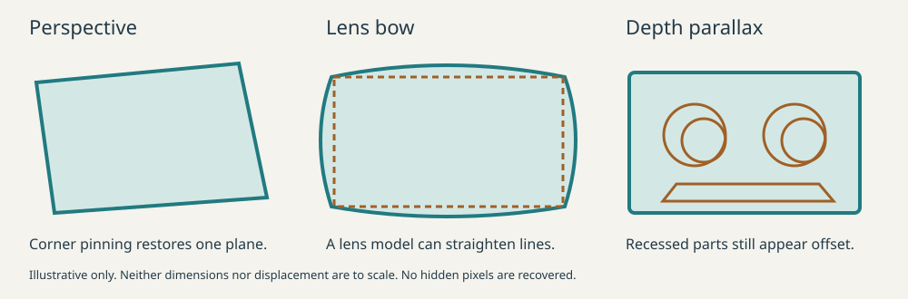

# Perspective, bowed edges, and depth

Version 0.6.0. These are archival derivatives of a photograph, not reconstructed
orthographic photographs of a 3D object. Keep the capture and transformation log.

## Three different effects

| Effect | What it does | What a single-photo correction can do |
| --- | --- | --- |
| Perspective | A planar rectangle becomes a quadrilateral; parallel lines can converge | A homography, often called corner pinning, maps the chosen plane back to a rectangle. Ideal perspective keeps straight lines straight. |
| Lens distortion | Straight lines bow outward (barrel) or inward (pincushion); decentering can add tangential distortion | A suitable lens model can undo the distortion. Calibration is stronger evidence than assuming every curved object edge is optical distortion. |
| Depth parallax | Raised, recessed, and rear surfaces appear displaced relative to the chosen front plane; sidewalls or hidden areas become visible or occluded | A single homography cannot flatten all depths correctly. True correction needs additional geometry, camera information, or views. Occluded pixels are unavailable. |

“De-parallax” describes the third problem. It is not the usual term for
straightening bowed borders. Mild bow is better called **radial lens distortion**
or simply **edge curvature** until its cause is established. A fisheye lens uses
a different, strongly nonlinear projection; this tool is not a general fisheye
converter. See [OpenCV camera calibration](https://docs.opencv.org/4.x/dc/dbb/tutorial_py_calibration.html)
for radial/tangential models and calibration, and the
[IPOL straight-line lens-estimation paper](https://www.ipol.im/pub/art/2011/ags-alde/)
for the principle of estimating distortion from lines known to be straight.



## What the cassette algorithm applies

1. Select long main-body edge samples, excluding rounded corners and short guide
   projections. Fit four straight lines. A blurred edge may use a logged linear
   fit to the measured trace when a coherent subpixel ridge is unavailable.
2. Intersect adjacent fitted **straight lines** to obtain virtual corners. Map
   their quadrilateral to 100.4 × 63.8 mm with a homography. Printed label corners,
   rounded arcs, and a whole-object bounding box do not define the body scale.
3. Measure the residual edge alignment and flag substantial departures. The
   default `--debow off` skips lens estimation and nonlinear bow correction.
4. Choose an opposed text orientation and compose every accepted mapping into
   one final color resampling. Analysis views are discarded.
5. For a close pre-warp cassette aspect ratio, fit each physical corner's outer
   quarter ellipse. Unsupported corners stay square. Warp original pixels once,
   then crop the rectangle and supported corner arcs with a slight centered
   feather. No exterior flood fill, silhouette erosion, guessed corner arc, inset,
   or retention band is applied. Source-canvas coverage is logged separately.

The experimental `--debow auto` mode instead tests a bounded, one-parameter
radial division model against alternating samples. It requires material
improvement on at least three edges and assumes the optical center is the image
center. It is **not calibrated**. This mode intersects fitted curves and may
apply a remaining boundary-normal blend for bow above 0.8 px and below 2.5% of
the short span. `--debow conform` skips radial correction and explicitly requests
that blend. These modes are opt-in comparisons, not the default workflow.
A known camera profile is not yet an input option. The correction is low order;
wavy molded plastic, shadows, bevels, or a wrong layer should not be fitted with
an increasingly flexible warp until they appear correct.

Camera and lens EXIF are preserved in the log when present, including recognition
of iPhone 7 Plus and iPhone 15 Pro Max. Missing tags and prior correction remain
unknown. Phone identity never supplies invented lens coefficients. See the
[camera-specific research and capture policy](IPHONE_CAMERAS.md).

The radial test uses neighboring samples, not independent photographs. Its
residual is a consistency check and can be fooled by a bowed shell. A lens
estimate from several unrelated straight objects or a calibration target is
better. The geometric order is lens undistortion **before** homography fitting;
the remaining edge adjustment is defined **after** corner pinning. Computation
composes their inverse maps so the final image is sampled only once.

## The unavoidable 3D-to-2D compromises

| Example from the supplied samples | What survives the correction | Log or review implication |
| --- | --- | --- |
| Gray D-C90 and dark SA-X shells | Hub teeth and rear walls can remain off-center inside a now frontal face opening | `cassette_single_plane_approximation`; teeth are retained, never forced into an ideal circular knockout |
| Yellow cassette's lower raised section | Its sloping shoulder, small-hole walls, and visible front bevel occupy other depths | The outer-frame fit is nominal. The code does not yet reliably isolate every main-face shoulder from the raised lip; residual edge conformance may shift those details. |
| Clear shell with red reels, only 361 × 244 pixels | White backing seen through clear plastic remains photographed content | Refit the weak outer boundary before correction, without a white retention band; final rectangular cropping preserves enclosed whites. `low_resolution_boundary_uncertainty` remains. |
| Pale blue shell on a changing dark/light background | Edge contrast can reverse sign, and some narrow borders approach the image boundary | Trace local unsigned gradient strength with path continuity, then crop straight after correction; `shell_near_image_boundary` remains |

For a symmetric nominal shell, the 12.0 mm raised-front thickness versus an
8.6 mm main thickness implies a 1.7 mm surface-height step on each face. A simple
weak-perspective estimate of apparent displacement after flattening is
`height_step × tan(tilt)`: about **0.30 mm at 10°**, **0.98 mm at 30°**, and
**1.70 mm at 45°**. These illustrate scale, not measured errors in these photos.
The dimensions and their source limitations are in [cassette geometry](CASSETTES.md).

The log's tilt proxy comes from apparent anisotropy of the fitted body frame. It
assumes square pixels and negligible remaining optical distortion; scanner
stretch, prior resizing, shell variation, or bad edge choices can confound it.
`detected_3d_geometry: false` makes clear that no depth map or camera pose was
recovered. The warning is based on known cassette construction. Actual parallax,
occluded area, shadow, and glare are not automatically measured in this release.

No attempt is made to synthesize a missing underside, erase a hub wall, invent
label text, or infer a fully transparent shell. Interior windows and photographed
backing remain image content. Long shell edges, rather than short rail bumps,
establish the frame. Supported measured corner arcs remove exterior corner
background after rectification. `--cassette-crop rectangle` retains square
corners for comparison. A clean alpha edge is not proof of correct depth.

## Does a CD need it, and only at severe angles?

**Lens correction can matter even head-on.** It depends on the lens, image
position, framing, focus, and any correction already applied by the camera.
A severe angle increases perspective and depth effects but does not by itself
establish radial distortion. Do not apply a second lens correction blindly to
an already corrected phone image.

For discs, use a calibrated profile from matching capture conditions, or strong
independent evidence such as a known straight reference target in the same plane.
In that workflow, undo lens distortion for geometry analysis before fitting the
rim and spindle conics, then compose lens, perspective, and rotation maps for the
single final resampling. This is a recommended future workflow: **the current
disc branch does not estimate or apply lens correction**.

A centered circle remains a circle under a centered radial warp; its radius
changes. Therefore a round outer edge, or a round alpha mask created by the
software, cannot establish that the interior artwork is undistorted. Nominal
inner/outer size constraints help but do not independently identify an arbitrary
lens model. Curved lettering and printed rings are not straight-line calibration
targets. Cassette edge-blend correction must not be transferred blindly to a CD.

Thin, flat disc surfaces are closer to a single plane than a cassette. A raised
jewel-case spindle, visible rim thickness, warped disc, or reflected highlight
still violates that simplification. Preserve or flag those observations instead
of treating them as recoverable physical detail.

## Reading the log

The following is an abbreviated **illustrative** cassette record; actual values
are calculated for each input:

```json
{
  "status": "review_required",
  "warnings": [
    "cassette_single_plane_approximation",
    "edge_bow_cause_unresolved",
    "edge_conformance_is_2d_approximation"
  ],
  "geometry": {
    "lens": {"applied": false, "calibrated": false},
    "conformance": {"applied": true, "model": "boundary_normal_cubic_blend"},
    "depth": {"detected_3d_geometry": false}
  }
}
```

The full record includes source hash, model coefficients, coordinate system,
body corners, edge RMS before/after correction, output scale and hash, crop bounds,
camera provenance, and short transformation notes. Detailed source edge samples and crop diagnostics are in
`*-orientation.json`. Those fit residuals share the samples used by the model;
they are not independent metrology or a guarantee that the selected layer is right.
