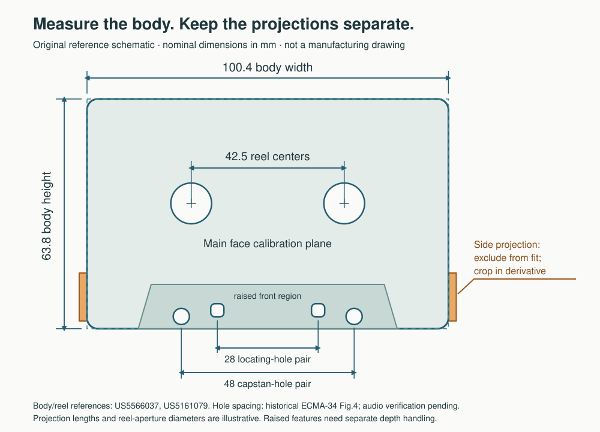

# Disc Straighten

An archival image preparation CLI for TapeArchives. Straighten optical discs and
compact-cassette photographs, choose a readable text orientation, and export
transparent PNG derivatives with reproducible geometry and review logs.

**Version 0.6.0 · macOS and Windows CMD · MIT · beta.** Cassette processing always
requires review. Keep the original capture as the preservation master.

## Quick start

On macOS, install Python 3.12+, ImageMagick 7, and Apple's Command Line Tools if needed:

```sh
brew install python imagemagick
xcode-select --install
./disc-straighten ./cassette-photos --media cassette -o processed --preview
```

The launcher creates a local Python environment, installs pinned dependencies,
and compiles the included Apple Vision helper on first OCR use. Subsequent
local-image processing runs offline. Source files remain unchanged. Accepts a
file, several files, a nonrecursive directory, or quoted HTTP(S) image URLs.
Existing results require `--overwrite`.

```sh
./disc-straighten disc-photo.jpg -o processed --preview
./disc-straighten mini-cd.jpg -o processed --disc-size 80
./disc-straighten mixed-photos --media auto -o processed --preview
./disc-straighten cassette.jpg --media cassette --debow off -o perspective-only
```

`--media disc` remains the default. Automatic selection is experimental: it tests
body-edge and reel-pair evidence, then tries the disc detector if that evidence
is insufficient. It can reject an input and does not handle multiple objects.
Tested on Apple Silicon macOS with Python 3.14.7. OCR uses Apple's system Vision
framework by default. Windows uses Tesseract 5. The same backend can be selected
on macOS with `--ocr tesseract`; engine and language differences are logged.

**If OCR cannot run, discs automatically try visual straightening from −45° to
+45°.** No option is required. The fallback aligns text-like marks by horizontal
projection sharpness; it cannot read the text or resolve upside-down labels.
Weak or competing evidence leaves the angle unchanged. Every fallback result
is flagged for review and logs its search range, chosen angle and OCR failure.
Use `--ocr none` to try it deliberately. Cassettes still need OCR or an explicit
`--angle 0` / `--angle 180` after body rectification.

On **Windows**, install Python 3.12+, ImageMagick 7 and Tesseract 5, extract the
source kit, and run from CMD:

```bat
disc-straighten.cmd -h
disc-straighten.cmd "C:\Photos\Tapes" --media cassette -o processed --preview
disc-straighten.cmd disc.jpg --languages eng --media auto -o processed
```

The launcher creates its local environment on first use. This is a source kit,
not a standalone executable. [Windows installation and troubleshooting](WINDOWS.md)
includes PATH, language data, batch exit codes and color management.

## What changes in the image

| Input | Geometry and orientation | Transparency |
| --- | --- | --- |
| Optical disc | Fit the physical rim and spindle aperture, normalize to concentric circles at nominal 15/120 or 15/80 ratio, then align the strongest text family | Remove exterior and spindle aperture; preserve the clear hub and matrix artwork |
| Compact cassette | Fit long body edges and intersect them; map to 100.4 × 63.8 mm; choose between opposed OCR orientations | Crop after correction, with measured corner arcs and a slight centered feather; preserve photographed interior openings |

The cassette default (`--debow off`) fits four straight main-body lines and
intersects adjacent lines to obtain the corners. One homography maps that frame
to the nominal rectangle, followed by the final crop and feather. A detected
pre-warp aspect ratio within 5% of **1.5736677:1** is tagged **compact cassette AR**.
It enables independent matching of each outer corner curve. Supported quarter
ellipses remove exterior corner background; uncertain corners remain square and
are flagged. No radius is assumed from the format name. `--cassette-crop rectangle`
provides the previous rectangle-only comparison. No lens or
nonlinear bow correction is applied. Explicit experimental `auto` and `conform`
modes remain available for reviewed comparisons. A single plane cannot remove
the depth parallax of a raised lip, recessed reel, or hole wall.
[Read the illustrated limitations and correction policy](LENS_AND_DEPTH.md).

Final pixels come from one composed warp of the original, in linear RGB with
premultiplied alpha: native EWA Lanczos3 for discs; continuous-phase Lanczos3 with
bounded footprint supersampling for cassettes. The default is 16-bit RGBA with
slightly feathered boundaries. No missing detail is synthesized.

Straight-edge selection uses long-span gradient evidence, avoiding short guide
rails and faint divergent background fringes. Rounded corners do not locate the
virtual corners. Edge residuals are logged so imperfect alignment remains
reviewable. See [crop assumptions](CASSETTES.md#low-resolution-crop-preservation).

## Results and review

Each input produces `*-straightened.png`, `*-straightened.json`, and
`*-orientation.json`; `--preview` adds a white-background cassette preview (dark
background for discs). No background color or outline is added to the RGBA master. Logs record
hashes, coordinates, transforms, geometry evidence, orientation alternatives,
versions, and limitations. Cassette logs also distinguish radial correction,
approximate edge conformance, and unresolved depth effects.
Both branches preserve allowlisted embedded camera/lens identity when present.
Missing metadata and unknown prior correction are explicit; phone names never
select guessed distortion coefficients. [iPhone camera research](IPHONE_CAMERAS.md).

Exit code **0** means no review flags, **2** means provisional results were
produced, and **1** means at least one input failed. Batches continue after
individual failures. All cassette results currently return review flags.

An exact output circle or rectangle is a geometric convention, not proof of
accurate interior artwork. Manufactured objects have tolerances; shadows, clear
plastic, cropped edges, and displaced printing can mislead detection. A single
photo cannot recover hidden surfaces or perfectly separate transparent material
from its photographed background. Disc lens distortion is **not** estimated by
this release; lens effects can occur even in head-on photographs.

## Documentation

| Guide | Contents |
| --- | --- |
| [Usage](USAGE.md) | Commands, options, coordinate conventions, outputs, overrides |
| [Windows CMD](WINDOWS.md) | Installation, launcher, Tesseract, paths with spaces, exit codes |
| [Lens distortion and depth](LENS_AND_DEPTH.md) | Bow versus perspective versus parallax; examples; cassette and disc policy |
| [iPhone cameras](IPHONE_CAMERAS.md) | iPhone 7 Plus / 15 Pro Max metadata, Apple lens correction, macro switching and calibration limits |
| [Reddit image references](research/REDDIT_IMAGE_REFERENCES.md) | Seven inspected diagrams/photos, dimension comparisons, and source limitations |
| [Cassette geometry](CASSETTES.md) | Implemented detection, nominal dimensions, guide rails, patents, source limitations |
| [Disc perspective](PERSPECTIVE.md) | Two-conic rectification and assumptions |
| [Disc standards](STANDARDS.md) | 120/80 mm profiles, tolerances, roundness verification |
| [Archivist tools](research/ARCHIVIST_TOOLS.md) | Catalog of 18 related open-source projects |
| [Performance](PERFORMANCE.md) | Timing evidence, optimizations, Rust decision |
| [Contributing](CONTRIBUTING.md) | Setup, tests, fixtures, review expectations |
| [Release preparation](RELEASING.md) | Public source export and builds |
| [Changes](CHANGELOG.md) | Version history |



The detailed [cassette reference profile](research/cassette-reference-profile.json)
remains research data. Runtime uses the nominal body dimensions and 42.5 mm reel
spacing; provisional pin-hole dimensions are not forced onto photographs.

## Development and validation

```sh
.venv/bin/python -m unittest discover -s tests -v
.venv/bin/python examples/synthetic_smoke.py
.venv/bin/python examples/cassette_smoke.py
.venv/bin/python package.py
```

Original synthetic controls exercise perspective, independent interior landmarks,
short guide projections, mixed background contrast, radial distortion, nonlinear
map inversion, continuous subpixel sampling, alpha, auto selection, OCR, and logs.
[Five supplied cassette photographs](cassette-validation-summary.json) were also processed and visually inspected;
they informed development and are not a held-out accuracy benchmark. The clear,
low-resolution shell and weak/cropped edges remain especially uncertain.

The [historical disc validation report](validation-report.json) retains its
v0.3.0 label. Disc geometry and rendering are unchanged in v0.6.0; OCR now has a
portable backend and automatic bounded visual deskew when OCR is unavailable.
GitHub Actions covers macOS and Windows, both generated-image smoke checks,
default missing-OCR behavior, the CMD launcher in a path with spaces, a wheel and source export.
Actual hosted run results are visible in the repository's Actions tab.

## License

Original code, documentation, and schematics are [MIT](LICENSE). Dependency
notices are in [THIRD_PARTY_NOTICES.md](THIRD_PARTY_NOTICES.md) and `licenses/`.
Apple framework binaries, supplied photographs, private derivatives, and
standards/patent PDFs are excluded from public packages. The software license
does not grant rights to those images or publications.
